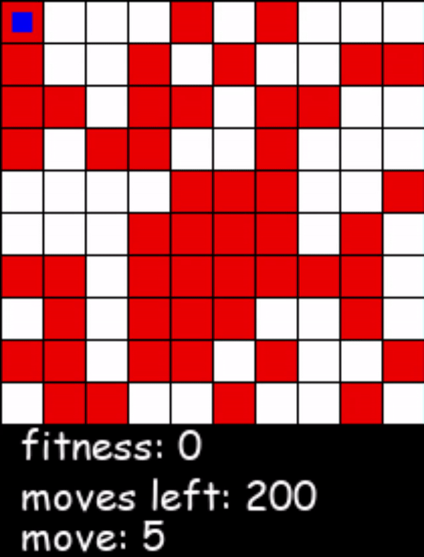

# Robby Robot Genetic Algorithm

A Genetic Algorithm based Robby the Robot in Chapter 9 of Melanie Mitchell's book Complexity: A Guided Tour

## Description
Robby lives in 10 x 10 game board. Where he has been tasked to clean. 
A game board consists of 50 randomly spaced cans that need to be cleaned by Robby. At first Robby is not very good at his job<
Robby's brain intially starts as a list of 243 randomly generated genes, but over time Robby will<
evolve a brain capable of cleaning his world.
 

Robby cannot see very well and can only see the square above, below, right, left and current postion, as well as if those squares are empty, have a can, or are a wall.
Robby Starts at posistion (0,0). Each cleaning session robby can take 200 actions, move up, down, left, right, stay put, pick up, and move a random direction.
If Robby runs into a wall he loses 5 points, if Robby picks up a can he gains 10 points, and if he attempts to pick up a can he loses 1 point.
 

Robby's genome conists of every possible situation he can see, 243 unique combinations, while not all situation are possible like Robby's current position being a wall
Evolving Robby's genome takes place over 1000 generations, where each generation has 200 robots. The robots run 100 cleaning sessions where their total fitness is calculated.
The better the robots fitness the higher chance it will have to breed. 

After 1000 generations Robby has come up with a pretty viable strategy averaging 450 points in 100 cleaning sessions:

    

You can see that the fitness of Robby quickly goes to about 400 where it starts to slow down dramatically and only makes smaller improvments until generation 1000

  

## Getting Started

pip install -r requirements.txt

run game.py to run a simulation.

watch.py will watch a specfic genome, copy and past your genome as a string into genome. Press space to start animation once it loads.

## Authors

Matthew Logan
